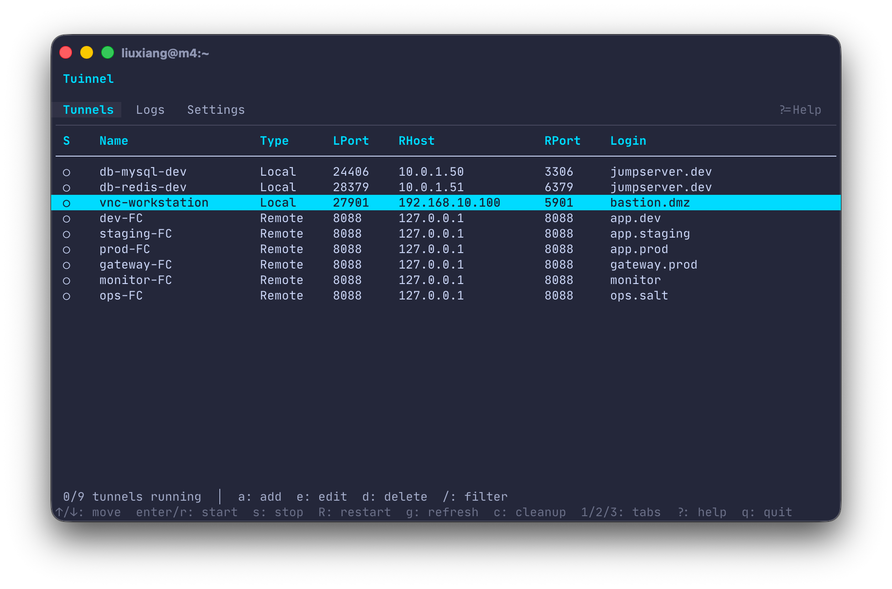

# tuinnel

基于终端的 SSH 隧道管理器，使用 Go、Bubble Tea 和 Bubbles 构建。提供多标签页 TUI 界面，支持通过 TOML 配置文件管理 SSH 隧道。

## 功能特性

- **三种隧道类型**：本地转发 (`-L`)、远程转发 (`-R`)、动态代理 (`-D`)
- **三标签页界面**：隧道列表、日志面板、全局设置
- **模态编辑器**：在隧道列表中直接新增/编辑/删除隧道配置
- **分组管理**：按分组批量启停隧道
- **实时日志**：查看每个隧道的 SSH 输出日志（环形缓冲区，最近 1000 行）
- **配置持久化**：TOML 格式配置文件，编辑后自动保存
- **SSH ControlMaster**：通过 Unix 控制套接字管理 SSH 连接生命周期
- **Stale 检测**：自动识别套接字与进程不匹配的异常隧道，支持一键清理
- **Orphan 扫描**：启动时自动检测未被管理的残留 SSH 隧道
- **安全确认**：退出时有运行中隧道或删除运行中隧道时，均需确认

## 快速开始

### 安装

```bash
go build -o tuinnel .
```

### 配置

首次运行会自动创建默认配置文件：

```
~/.config/tuinnel/config.toml
```

也可通过环境变量指定配置文件路径：

```bash
SSH_TUN_TUI_CONFIG=/path/to/config.toml ./tuinnel
```

或手动复制示例配置：

```bash
mkdir -p ~/.config/tuinnel
cp examples/config.toml ~/.config/tuinnel/config.toml
```

### 运行

```bash
./tuinnel
```

### 测试

```bash
go test ./...              # 运行所有测试
go test -short ./...       # 跳过集成测试
```

## 配置说明

```toml
[settings]
ssh_bin = "ssh"                  # SSH 二进制文件路径
control_dir = "/tmp/tuinnel" # 控制套接字目录
kill_on_exit = false              # 退出时是否关闭所有隧道

# 本地端口转发
[[tunnels]]
name = "dev-db"
type = "local"           # local | remote | dynamic
local_port = 3307
remote_host = "localhost"
remote_port = 3306
login = "deploy@db-server"
group = "dev"            # 可选，用于分组管理

# 远程端口转发
[[tunnels]]
name = "expose-web"
type = "remote"
local_port = 8080
remote_host = "localhost"
remote_port = 80
login = "deploy@web-server"
group = "prod"

# 动态代理（SOCKS）
[[tunnels]]
name = "proxy"
type = "dynamic"
local_port = 1080
login = "jump@bastion"
```

### 隧道类型

| 类型     | 标志 | 转发规则                             |
|----------|------|--------------------------------------|
| 本地转发 | `-L` | `local_port:remote_host:remote_port` |
| 远程转发 | `-R` | `remote_port:remote_host:local_port` |
| 动态代理 | `-D` | `local_port`（SOCKS 代理）           |

### 隧道状态

| 状态   | 图标 | 说明               |
|--------|------|--------------------|
| 运行中 | ●   | 正常运行           |
| 已停止 | ○   | 未启动或已停止     |
| 异常   | ✗    | 启动失败           |
| Stale  | ◐   | 套接字与进程不匹配 |

## 界面布局

```
┌─ tuinnel ────────────────────────────────────────┐
│ [隧道] [日志] [设置]                   ?=帮助    │
├──────────────────────────────────────────────────┤
│                                                  │
│              (当前标签页内容)                    │
│                                                  │
├──────────────────────────────────────────────────┤
│ 1/4 隧道运行中 │ stale: 1 │ j/k: 上下移动        │
└──────────────────────────────────────────────────┘
```



### 标签页

- **隧道列表**：表格视图，显示隧道状态、名称、类型、端口等信息；支持模态编辑器新增/编辑/删除隧道
- **日志面板**：左侧紧凑隧道列表 + 右侧选中隧道的 SSH 日志（可滚动）
- **全局设置**：SSH 路径、控制套接字目录、退出行为

## 快捷键

### 全局

| 按键                | 功能                     |
|---------------------|--------------------------|
| `1` / `2` / `3`     | 切换标签页               |
| `Tab` / `Shift+Tab` | 下一个 / 上一个标签页    |
| `q` / `Ctrl+C`      | 退出（隧道运行时需确认） |
| `?`                 | 帮助对话框               |

### 隧道列表

| 按键        | 功能                     |
|-------------|--------------------------|
| `↑` / `↓` | 上下选择                 |
| `Enter`     | 启动隧道                 |
| `s`         | 停止隧道                 |
| `R`         | 重启隧道                 |
| `a`         | 新增隧道                 |
| `e`         | 编辑隧道                 |
| `d`         | 删除隧道（运行中需确认） |
| `g`         | 刷新状态                 |
| `c`         | 清理 stale 隧道          |
| `/`         | 搜索过滤                 |

### 日志面板

| 按键        | 功能     |
|-------------|----------|
| `↑` / `↓` | 选择隧道 |
| `j` / `k`   | 滚动日志 |

### 全局设置

| 按键     | 功能         |
|----------|--------------|
| `Enter`  | 编辑当前字段 |
| `Tab`    | 切换字段     |
| `Ctrl+S` | 保存设置     |
| `Esc`    | 放弃修改     |

### 编辑器模态框

| 按键                | 功能                             |
|---------------------|----------------------------------|
| `Tab` / `Shift+Tab` | 切换字段                         |
| `Enter`             | 下一个字段（最后一个字段时保存） |
| `Ctrl+S`            | 保存                             |
| `Esc`               | 取消                             |

## 项目结构

```
tuinnel/
├── main.go                        # 入口，Bubble Tea 初始化
├── cmd/
│   └── test-start/
│       └── main.go                # 隧道操作测试工具
├── internal/
│   ├── app/
│   │   └── model.go               # 顶层 App Model，标签页切换
│   ├── tunnel/
│   │   ├── tunnel.go              # Tunnel 结构体定义与校验
│   │   ├── manager.go             # SSH 隧道生命周期管理
│   │   └── config.go              # TOML 配置读写
│   ├── ui/
│   │   ├── styles.go              # 全局 Lipgloss 主题样式
│   │   └── tabs/
│   │       ├── tablist.go         # 标签栏组件
│   │       ├── tunnel_list.go     # 隧道列表标签页
│   │       ├── logs.go            # 日志面板标签页
│   │       ├── settings.go        # 全局设置标签页
│   │       └── editor.go          # 隧道编辑器（模态弹窗）
│   └── ssh/
│       └── client.go              # SSH 命令封装（ControlMaster 操作）
├── examples/
│   └── config.toml                # 示例配置文件
├── testdata/                      # 测试数据
│   ├── config_valid.toml
│   └── config_empty.toml
└── docs/
    └── plans/                     # 设计文档与实施计划
```

## 技术栈

- Go 1.23+
- [Bubble Tea](https://github.com/charmbracelet/bubbletea) v2 — TUI 框架
- [Bubbles](https://github.com/charmbracelet/bubbles) v2 — 预构建 UI 组件
- [Lipgloss](https://github.com/charmbracelet/lipgloss) v2 — 样式引擎
- [BurntSushi/toml](https://github.com/BurntSushi/toml) — TOML 解析

## License

MIT
